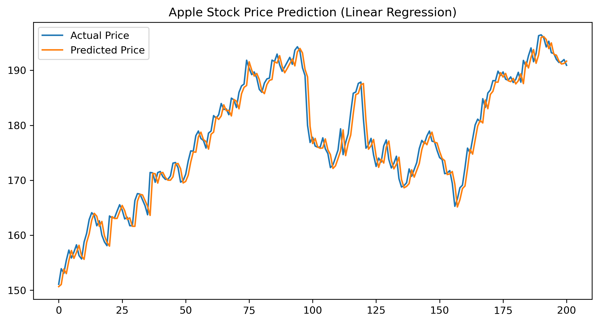

# 📈 Stock Price Predictor (Basic Linear Regression)

This project was completed as part of my **AI Internship** at **Codec Technologies India**.  
The goal was to build a simple **machine learning model** that predicts **the next day’s closing stock price** based on historical data, using **Linear Regression**.

---

## 🚀 Features
- Fetches historical stock price data from Yahoo Finance
- Predicts the next day's closing price
- Visualizes actual vs predicted prices
- Beginner-friendly ML implementation

---

## 🛠️ Tech Stack
- **Python 3**
- [yfinance](https://pypi.org/project/yfinance/) – to download stock data
- [pandas](https://pandas.pydata.org/) – data processing
- [scikit-learn](https://scikit-learn.org/stable/) – Linear Regression model
- [matplotlib](https://matplotlib.org/) – data visualization

---

## 📂 Project Structure

```
├── Stock_prediction.ipynb    # Main script
├── stock_predictions.csv       # Saved predictions
├── prediction-chart.png       # Chart Image
├── README.md                   # Project documentation
```


---

## 📊 How It Works
1. Fetches stock price data for a given ticker (e.g., AAPL) from Yahoo Finance.
2. Prepares the data by shifting the closing prices to predict the next day's price.
3. Trains a **Linear Regression** model on historical prices.
4. Plots actual vs predicted prices for easy comparison.

---

## ▶️ How to Run
1. **Clone the repository**
   ```
   git clone https://github.com/your-username/stock-price-predictor.git
   cd stock-price-predictor
   ```

2. **Install dependencies**

   ```
   pip install yfinance pandas scikit-learn matplotlib
   ```

3. **Run the script**

   ```
   python stock_price_predictor.py
   ```

4. **Example Output**

   * CSV file `stock_predictions.csv` with actual and predicted prices
   * Chart comparing actual vs predicted prices

---

## 📌 Example Visualization



---

## 📅 Future Improvements

* Add multiple stock prediction support
* Include more features (volume, moving averages)
* Try advanced models (LSTM, Prophet)

---

## 📜 Internship Context

This project was completed as a **Task** under the **AI Internship** by **Codec Technologies India**.
It is one of the deliverables for the internship submission.
